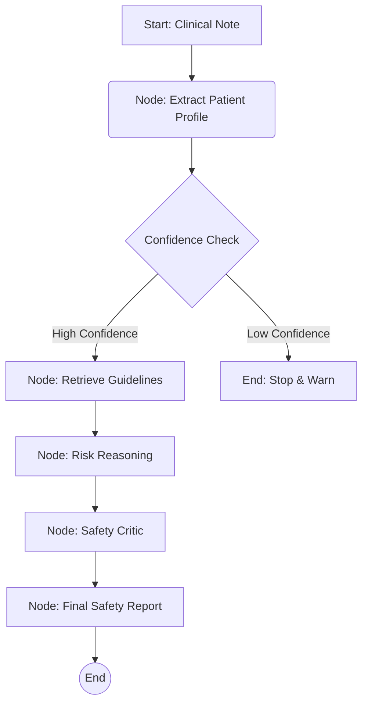

# 🛡️ Clinical Medication Safety Agent (RxGuard)


**RxGuard** is an advanced AI copilot designed to prevent medication errors in real-time. By combining the reasoning power of **Llama 3.3 (via Groq)** with **Retrieval-Augmented Generation (RAG)**, it cross-references patient data against authoritative clinical guidelines to ensure safe prescribing decisions.

> **Note:** This is the official **Version 1.0** release of RxGuard.

---

## 🚀 The Problem & Solution

**The Challenge:** Medication errors are a leading cause of patient harm globally. Clinicians often lack immediate access to patient-specific contraindications within their workflow.

**The Solution:** RxGuard acts as a seamless safety layer. It understands clinical context, retrieves guidelines (WHO, NICE), and reasons about potential risks—delivering critical insights in seconds.

---

## 🏗️ System Architecture

RxGuard employs a **multi-agent workflow** orchestrated by LangGraph to ensure accuracy and reduce hallucinations.



### 🧠 Core Components

1.  **Context Extraction (`extraction_node`)**:
    *   Uses LLMs to parse unstructured text into strict **Pydantic models**.
    *   Extracts Age, Conditions (e.g., CKD Stage 3), and Current Medications.

2.  **Guideline Retrieval (RAG)**:
    *   Vector search (FAISS) finds relevant clinical guidelines based on the specific patient condition and proposed drug.
    *   *Source:* WHO, NICE, and specialized treatment protocols.

3.  **Risk Reasoning Engine**:
    *   Acts as a "Clinical Pharmacist" agent.
    *   Analyzes the **mechanism of action** (e.g., "NSAIDs constrict afferent arterioles...").
    *   Assigns a risk level: **Low**, **Moderate**, or **High**.

4.  **Safety Critic**:
    *   A second-pass agent that critiques the reasoning.
    *   Filters out minor issues and flags only **escalation-level** safety concerns to prevent alert fatigue.

---

## ✨ Key Features

*   **Context-Aware Analysis**: Automatically extracts key data points without manual entry.
*   **Evidence-Based Safety Checks**: Every alert is backed by a specific citation (Source & Page Number).
*   **Structured Outputs**: Returns strictly typed JSON data for easy integration into EHR systems.
*   **High-Speed Inference**: Powered by **Groq** for near-instantaneous (<1s) clinical feedback.

---

## 🛠️ Built With

*   **Orchestration**: [LangGraph](https://langchain-ai.github.io/langgraph/) & [LangChain](https://www.langchain.com/) for stateful multi-agent flows.
*   **LLM Inference**: [Groq](https://groq.com/) (Llama 3.3 70B) for speed and reasoning.
*   **Validation**: [Pydantic](https://docs.pydantic.dev/) for enforcing strict data schemas.
*   **Vector Search**: [FAISS](https://github.com/facebookresearch/faiss) & [HuggingFace Embeddings](https://huggingface.co/).
*   **Frontend**: [Streamlit](https://streamlit.io/) for the demo interface.
*   **Package Management**: [uv](https://github.com/astral-sh/uv) (Astral) for lightning-fast dependency resolution.

---

## ⚡ Quick Start

Get the application running in minutes.

```bash
# 1. Clone the repository
git clone https://github.com/CodeNeuron58/RxGuard.git
cd RxGuard

# 2. Sync dependencies
uv sync

# 3. Run the application
streamlit run src/app.py
```

> **Note:** You will need a valid `GROQ_API_KEY` in your `.env` file.

---

### 📂 Project Structure

A clean, modular architecture designed for scalability.

*   `src/agentic/graph`: Core LangGraph nodes and edge definitions.
*   `src/agentic/state`: Pydantic schemas defining the data flow.
*   `src/ui`: Streamlit interface components.
*   `data/`: Knowledge base and vector stores.

---

*Built for the MedGemma Impact Challenge 2025.*