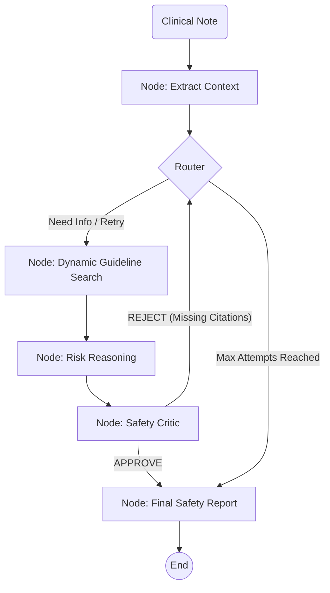

# 🛡️ RxGuard: Agentic Medication Safety Copilot


**RxGuard** is an intelligent clinical agent designed to prevent medication errors by "thinking before it speaks." Unlike varying chatbots, RxGuard uses a **Reflexive Agent Architecture** to retrieve guidelines, reason about risks, and—crucially—**critique and correct its own analysis** before alerting the clinician.

---

## 🚀 The "Agentic" Difference

Traditional clinical decision support systems are linear: `Input -> Rules -> Alert`. They fail when rules are ambiguous or patient context is complex.

**RxGuard is cyclic.** It mimics a senior pharmacist's thought process:
1.  **Read:** Understands the patient's full context (e.g., "Stage 3 CKD").
2.  **Research:** Dynamically generates search queries for relevant guidelines.
3.  **Reason:** Analyzes risks (e.g., "NSAIDs cause afferent arteriole vasoconstriction").
4.  **Reflect:** A "Safety Critic" node reviews the analysis. IF the evidence is weak, it **rejects** the finding and sends the agent back to do more research.

---

## 🏗️ System Architecture

RxGuard employs a **stateful, cyclic multi-agent workflow** orchestrated by [LangGraph](https://langchain-ai.github.io/langgraph/).


```mermaid
graph TD
    Start(Clinical Note) --> Extract[Node: Extract Context]
    Extract --> Router{Router}
    
    Router -- "Need Info / Retry" --> Retrieve[Node: Dynamic Guideline Search]
    Retrieve --> Reason[Node: Risk Reasoning]
    Reason --> Critic[Node: Safety Critic]
    
    Critic -- "REJECT (Missing Citations)" --> Router
    Critic -- "APPROVE" --> Report[Node: Final Safety Report]
    
    Router -- "Max Attempts Reached" --> Report
    Report --> End((End))
```

### 🧠 Core Agents

1.  **Router Node**: The traffic controller. It tracks the "Research Log" and prevents infinite loops. If the agent fails to find a safe answer after 3 attempts, it forces a "WARNING" state to ensure patient safety.
2.  **Guideline Retriever**: Not just a vector search. It uses an LLM to **generate targeted queries** based on the Critic's feedback (e.g., *"Find renal dosing specific to elderly males"*).
3.  **Risk Reasoning Engine**: The clinical logic core. Applies physiological mechanisms to patient data.
4.  **Safety Critic**: The gatekeeper. It strictly enforces that every claim must have a citation.

---

## ✨ Key Features

*   **Self-Correcting Loops**: If the agent initially misses a contraindication, the Critic forces a re-evaluation.
*   **Dynamic Tool Use**: The system generates its own queries, allowing it to "investigate" complex cases.
*   **Transparent Thought Process**: The UI shows the agent's "Research Log," so clinicians can trust the output.
*   **Edge-Ready Design**: Architected to swap the reasoning brain with **MedGemma 2B/7B (Quantized)** for local deployment.

---

## 🛠️ Tech Stack

*   **Orchestration**: [LangGraph](https://langchain-ai.github.io/langgraph/) (Cyclic StateGraph).
*   **Reasoning**: Llama 3.3 70B (via Groq) / MedGemma Ready.
*   **Validation**: [Pydantic](https://docs.pydantic.dev/) (Strict Output Schemas).
*   **Retrieval**: FAISS + HuggingFace Embeddings.
*   **UI**: Streamlit (with Custom "Thought Trace" Component).

---

## ⚡ Quick Start

Get the application running in minutes.

```bash
# 1. Clone the repository
git clone https://github.com/CodeNeuron58/RxGuard.git
cd RxGuard

# 2. Sync dependencies (using uv)
uv sync

# 3. Set your API Key
# Create a .env file with: GROQ_API_KEY=your_key_here

# 4. Run the application
streamlit run src/app.py
```

---

## 📂 Project Structure

```
src/
├── agentic/
│   ├── graph/          # LangGraph Nodes & Edges
│   │   ├── nodes/      # Router, Critic, Reasoning, Retrieval
│   │   └── builder.py  # The Cyclic Graph Compiler
│   ├── state/          # Pydantic Schemas (Memory, Logs)
│   └── agents/         # LLM Interface
├── ui/                 # Streamlit Components
└── app.py              # Main Application Entrypoint
```
