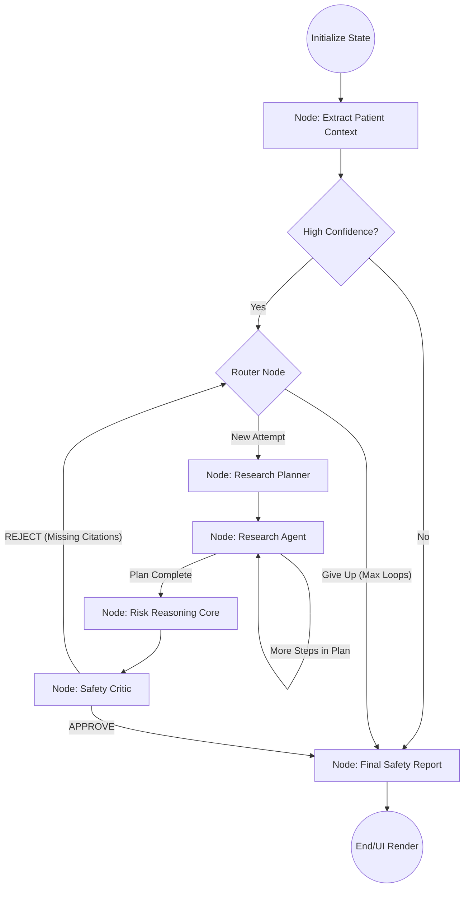

# 🛡️ RxGuard: Agentic Medication Safety Copilot


**RxGuard** is an intelligent clinical agent designed to prevent medication errors by "thinking before it speaks." Unlike standard deterministic rule-engines or varying LLM chatbots, RxGuard uses a **Reflexive Agent Architecture** powered by a cyclic graph state. It retrieves medical guidelines, reasons about multi-systemic patient risks, and crucially—**critiques, rejects, and corrects its own analysis** before alerting a clinician.

Designed for absolute privacy, RxGuard runs inference entirely locally.

---

## 🚀 The "Agentic" Difference

Traditional Clinical Decision Support Systems (CDSS) are linear (`Input -> Rules -> Alert`). They suffer from massive "alert fatigue" and fail entirely when rules become ambiguous or when dealing with complex, multi-morbid patient contexts.

**RxGuard is cyclic and stateful.** It mimics the methodical thought process of a senior clinical pharmacist through deliberate stages:

1.  **Extract:** Understands the unstructured clinical note (e.g., pulling "Stage 3 CKD" from a raw paragraph).
2.  **Plan:** Breaks down the complex clinical question into a prioritized research checklist.
3.  **Research:** A worker agent dynamically generates queries, fetching and evaluating specific evidence from a vector store.
4.  **Reason:** The core reasoning engine synthesizes the retrieved guidelines against the patient's physiological context.
5.  **Reflect & Critique:** A dedicated "Safety Critic" node reviews the proposed clinical alert. If the reasoning lacks explicit citations or logical rigor, the Critic **rejects** the finding and routes the agent back to the Planning phase to try again.

---

## 🏗️ Deep Dive: System Architecture

RxGuard's brain is orchestrated using [LangGraph](https://langchain-ai.github.io/langgraph/), implementing a sophisticated state machine that enforces accountability at every step.


```mermaid
graph TD
    Start((Initialize State)) --> Extract[Node: Extract Patient Context]
    Extract --> ConfidenceCheck{High Confidence?}
    
    ConfidenceCheck -- "Yes" --> Router{Router Node}
    ConfidenceCheck -- "No" --> Report[Node: Final Safety Report]
    
    Router -- "New Attempt" --> Planner[Node: Research Planner]
    Router -- "Give Up (Max Loops)" --> Report
    
    Planner --> Retrieve[Node: Research Agent]
    
    Retrieve -- "More Steps in Plan" --> Retrieve
    Retrieve -- "Plan Complete" --> Reason[Node: Risk Reasoning Core]
    
    Reason --> Critic[Node: Safety Critic]
    
    Critic -- "REJECT (Missing Citations)" --> Router
    Critic -- "APPROVE" --> Report
    
    Report --> End((End/UI Render))
```

### 🧠 Node Responsibilities 

1.  **Context Extractor (`extract_patient_profile`)**: The ingestion layer. Submits raw clinical notes to a strict Pydantic model to extract structured data (Age, Gender, Comorbidities, Proposed Medication). It outputs a `confidence_score`.
2.  **The Router (`router_node`)**: The loop manager. Keeps track of how many times the agent has failed the Critic's checks. If attempts > max, it forces a graceful failure rather than an infinite loop.
3.  **Research Planner (`planner_node`)**: Given the structured patient profile, it generates an executable Pydantic `Plan` (e.g., `[Step 1: Check renal dosing; Step 2: Check drug-disease interactions for NSAIDs + CKD]`).
4.  **Research Agent (`research_agent_node`)**: The executor. It takes the current step from the plan, generates a FAISS similarity search query, retrieves chunks from the clinical guidelines vector store, and logs findings to the state. Loops back to itself until all plan steps are complete.
5.  **Risk Reasoning Core (`risk_reasoning_node`)**: The synthesizer. It reads the complete `research_log` and the `patient_profile` to deduce the actual clinical risk level, outputting a structured diagnosis.
6.  **Safety Critic (`safety_critic_node`)**: The gatekeeper. It acts antagonistically towards the Reasoning Core. It checks: *Is the risk adequately explained? Are there hallucinations? Are there explicit citations?* It outputs "APPROVE" or "REJECT". If rejected, the state flows back to the Router.

---

## ✨ Key Technical Features

*   **⚡ Live Thought Trace Streaming**: The Streamlit UI intercepts the LangGraph stream, allowing users to watch the agent "think" in real-time. The UI renders the Plan, Research execution, and Critique loops transparently.
*   **🧠 Deterministic Outputs via Pydantic**: LLM hallucinations are drastically reduced by forcing every node in the graph to return strictly validated JSON structures.
*   **📚 Automated RAG Pipeline**: Ingests raw clinical guideline text and converts it into structured, retrievable embeddings (FAISS + HuggingFace).
*   **� 100% Local Execution**: Built to operate in highly air-gapped clinical environments. Inference is driven completely by local, open-source models via Ollama. 

---

## 🛠️ Tech Stack

*   **Language**: Python 3.12+
*   **Agent Orchestration**: [LangGraph](https://langchain-ai.github.io/langgraph/) (Cyclic StateGraph).
*   **LLM Interface**: LangChain & Ollama.
*   **Primary LLM**: MedGemma-4b (for clinical reasoning).
*   **Validation**: [Pydantic](https://docs.pydantic.dev/).
*   **Vector Database**: FAISS CPU.
*   **Embeddings**: HuggingFace (`sentence-transformers/all-MiniLM-L6-v2`).
*   **Frontend**: Streamlit.

---

## ⚡ Quick Start

Provide a local environment to safely test RxGuard.

### Prerequisites
*   Python 3.12+ installed.
*   [`uv`](https://docs.astral.sh/uv/) installed for fast dependency management.
*   [Ollama](https://ollama.com/) installed and running locally.

### Installation

```bash
# 1. Clone the repository
git clone https://github.com/CodeNeuron58/RxGuard.git
cd RxGuard

# 2. Sync dependencies
uv sync

# 3. Pull the recommended local LLM via Ollama
# (You can change the target model in src/config/settings.py)
ollama pull alibayram/medgemma:4b

# 4. Generate the FAISS Vector Database (Required first run)
# This will parse guidelines in data/ and build the local knowledge base
python src/data/ingest_structured.py

# 5. Boot the application
streamlit run src/app.py
```

---

## 📂 Project Structure

A clean, modular, production-ready layout:

```text
.
├── config/             # App Settings & Environmental configuration
├── data/               # Raw medical guidelines & generated Vector Database
├── src/
│   ├── agentic/        # The Core AI Logic
│   │   ├── graph/      # LangGraph orchestration (edges, nodes, builder.py)
│   │   ├── state/      # Pydantic Schemas defining our StateGraph
│   │   └── utils/      # Logging and common tools
│   ├── ui/             # Streamlit specific components (if decoupled)
│   └── app.py          # Streamlit UI entrypoint & rendering logic
├── pyproject.toml      # Dependency definitions
└── README.md
```
