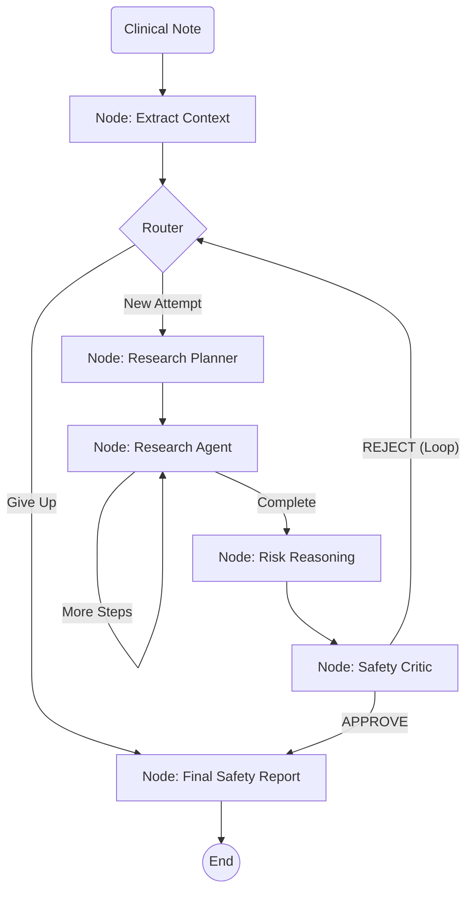

# 🛡️ RxGuard: Agentic Medication Safety Copilot


**RxGuard** is an intelligent clinical agent designed to prevent medication errors by "thinking before it speaks." Unlike varying chatbots, RxGuard uses a **Reflexive Agent Architecture** to retrieve guidelines, reason about risks, and—crucially—**critique and correct its own analysis** before alerting the clinician.

---

## 🚀 The "Agentic" Difference

Traditional clinical decision support systems are linear: `Input -> Rules -> Alert`. They fail when rules are ambiguous or patient context is complex.

**RxGuard is cyclic.** It mimics a senior pharmacist's thought process:
1.  **Read:** Understands the patient's full context (e.g., "Stage 3 CKD").
2.  **Plan:** Break down the clinical question into a research checklist.
3.  **Research:** Dynamically generates search queries for relevant guidelines.
4.  **Reason:** Analyzes risks (e.g., "NSAIDs cause afferent arteriole vasoconstriction").
5.  **Reflect:** A "Safety Critic" node reviews the analysis. IF the evidence is weak, it **rejects** the finding and sends the agent back to do more research.

---

## 🏗️ System Architecture

RxGuard employs a **stateful, cyclic multi-agent workflow** orchestrated by [LangGraph](https://langchain-ai.github.io/langgraph/).


```mermaid
graph TD
    Start(Clinical Note) --> Extract[Node: Extract Context]
    Extract --> Router{Router}
    
    Router -- "New Attempt" --> Planner[Node: Research Planner]
    Router -- "Give Up" --> Report[Node: Final Safety Report]
    
    Planner --> Retrieve[Node: Research Agent]
    
    Retrieve -- "More Steps" --> Retrieve
    Retrieve -- "Complete" --> Reason[Node: Risk Reasoning]
    
    Reason --> Critic[Node: Safety Critic]
    
    Critic -- "REJECT (Loop)" --> Router
    Critic -- "APPROVE" --> Report
    
    Report --> End((End))
```

### 🧠 Core Agents

1.  **Router**: Manages the cyclic workflow, tracking attempts and deciding whether to retry or fail.
2.  **Planner Node**: Decomposes the query into specific research steps (e.g. "Check renal dosing").
3.  **Research Agent**: A dedicated worker that executes the plan, fetching evidence from the Vector Store.
4.  **Risk Reasoning Engine**: The clinical logic core. Applies physiological mechanisms to patient data.
5.  **Safety Critic**: The gatekeeper. It strictly enforces that every claim must have a citation.

---

## ✨ Key Features (v3.0.0)

*   **⚡ Live Thought Trace**: Watch the agent "think" in real-time. The UI streams every step of the Plan, Research, and Critique loop, showing token-by-token generation for transparent reasoning.
*   **🧠 Structured Reasoning**: Complex thought processes are collapsed by default to keep the UI clean, but can be expanded to inspect the raw "chain of thought."
*   **📚 Automated Data Pipeline**: Ingests raw text and converts it into structured `EvidenceItem` JSONs using LLM-based chunking.
*   **🔌 Powered by Groq**: Optimized for speed using Llama 3 via Groq's LPU inference engine.
*   **Self-Correcting**: If the agent initially misses a contraindication, the Critic forces a re-evaluation.

---

## 🛠️ Tech Stack

*   **Orchestration**: [LangGraph](https://langchain-ai.github.io/langgraph/) (Cyclic StateGraph).
*   **Reasoning**: Llama 3.3 70B (via Groq).
*   **Validation**: [Pydantic](https://docs.pydantic.dev/) (Strict Output Schemas).
*   **Retrieval**: FAISS + HuggingFace Embeddings.
*   **UI**: Streamlit (Reasoning Tracing enabled).

---

## ⚡ Quick Start

Get the application running in minutes.

```bash
# 1. Clone the repository
git clone https://github.com/CodeNeuron58/RxGuard.git
cd RxGuard

# 2. Sync dependencies (using uv)
uv sync

# 3. Set your API Key
# Create a .env file with: GROQ_API_KEY=your_key_here

# 4. Run the application
streamlit run src/app.py
```

---

## 📂 Project Structure

```
.
├── config/             # Environment & App Settings
├── data/               # Vector Store & Guidelines
├── src/
│   ├── agentic/
│   │   ├── graph/      # LangGraph Nodes & Edges
│   │   │   ├── nodes/  # Router, Critic, Reasoning, Retrieval
│   │   │   └── builder.py
│   │   ├── state/      # Pydantic Schemas
│   │   └── agents/     # LLM Interface
│   ├── ui/             # Streamlit Components
│   └── app.py          # Main Application Entrypoint
└── pyproject.toml
```
